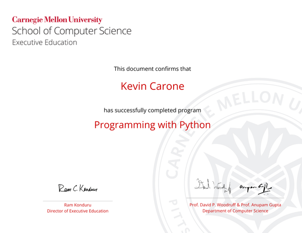

# Machine Learning Portfolio
---
## Certifications

### Programming in Python certificate from Carnegie Mellon University

This certificate is from a 10 week course that includes a capstone project on DNA sequencing. Click below for a link to the folder for DNA sequencing.

